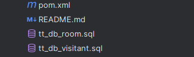
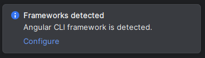
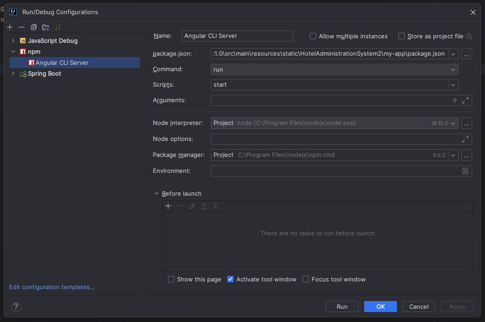

# Hotel Administration Service

Для запуску проекта потрібно налаштувати базу данних під ваш адресс та пароль, в файлі application.properties

Після цього можете запускати проект, для генерації таблиць в бд, потім запустіть данні файли з кореня проекту: 

Також важливо налаштувати Angular CLI, так як мій проект піднімає як Spring так і Angular, йому потрібно запустити їх обох. Щоб це зробити потрібно додати до конфігурації Angular CLI, Ви могли це зробити натискаючи на Configure, у повідомленні про виявлення Ангуляр після завантаження проекту:

Також у вас має бути установлений node.js, а конфігурація запуску буде мати вигляд:

Важливо щоб вони і Angular CLI, i Spring Boot були запущенні паралельно. 

Сторінка фронта за замовчуванням знаходиться за адресою:
http://localhost:4200/
